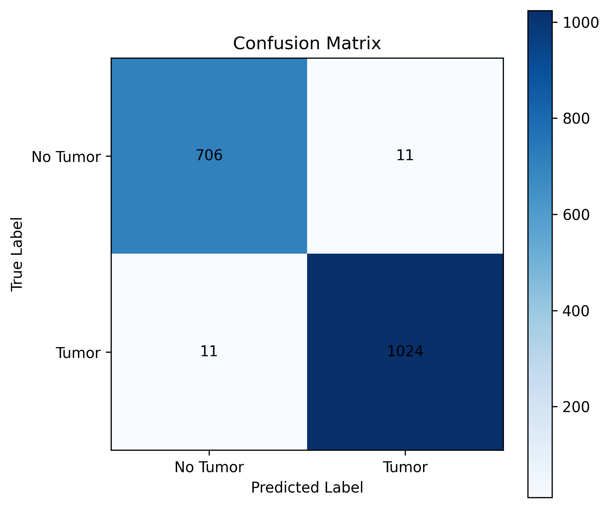

# Brain Tumor Detection & Explainable AI using MobileNetV2

This repository contains an end-to-end Deep Learning pipeline designed to detect brain tumors from MRI images. The project leverages **Transfer Learning** with **MobileNetV2** for highly accurate binary classification and integrates **Grad-CAM (Gradient-weighted Class Activation Mapping)** to provide visual explanations of the model's predictions.

---

## 📌 Project Overview
* **Objective:** Binary classification of MRI scans into `Tumor` and `No Tumor`.
* **Architecture:** Pre-trained **MobileNetV2** base (fine-tuned the last 30 layers) followed by Global Average Pooling, a Dense layer with L2 regularization, Dropout, and a Sigmoid output layer.
* **Explainability (XAI):** Implemented a custom TensorFlow Grad-CAM pipeline to generate visual heatmaps overlaying the MRI images, highlighting the exact areas influencing the network's classification.
* **Pre-processing:** Includes image brightness distribution analysis and real-time image data augmentation (rotation, zoom, horizontal flip, and brightness adjustment).

---

## 📊 Dataset Insights & Results

### 1. Data Processing
* Automatic parsing and counting of the training split.
* Explored data variance using an image brightness histogram to ensure training robustness across different scanner contrasts.

### 2. Model Performance
The model achieves exceptional metrics on the test data. Below is the performance evaluation breakdown:

* **Confusion Matrix:**
  The model shows an extremely low false-negative and false-positive rate.
  
  

* **Key Metrics:**
  * High precision and recall for both classes.
  * Stabilized training and validation tracking utilizing `EarlyStopping` and `ReduceLROnPlateau` callbacks to prevent overfitting.

---

## 🛠️ Visualizing Decisions with Grad-CAM
To bridge the gap between AI predictions and clinical trust, the project extracts gradients from the final convolutional layer (`Conv_1`) of MobileNetV2. It overlays a Jet colormap heatmap onto the input MRI scan to visualize where the model detects tumorous tissue patterns.

